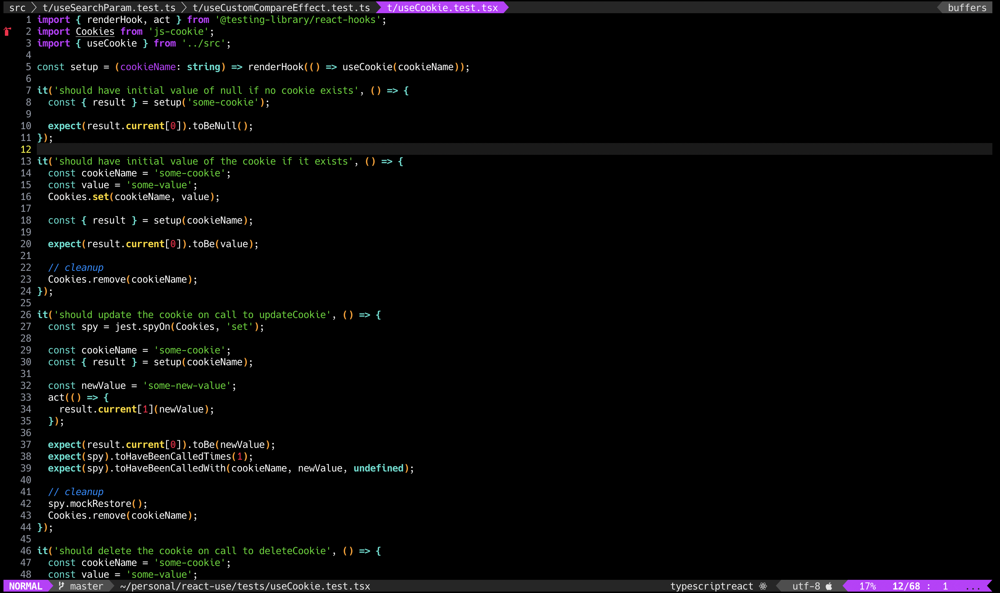
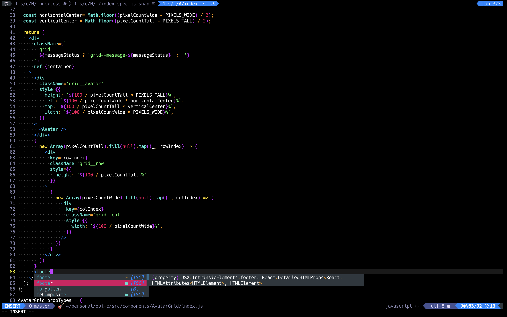
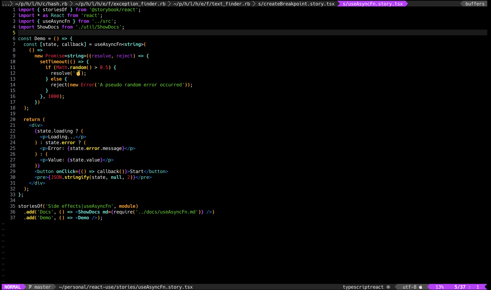
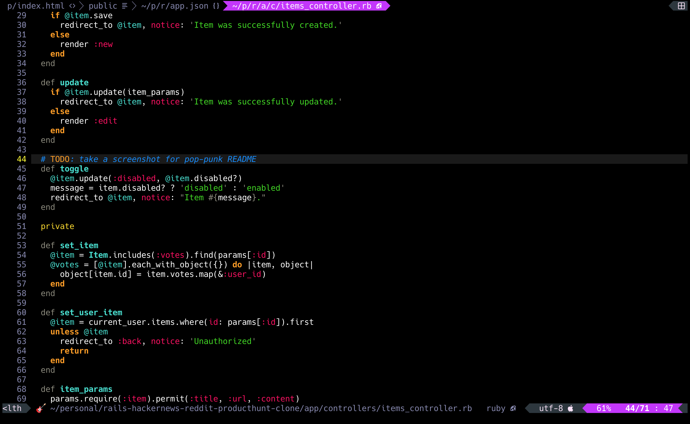

# 🎸 Pop-Punk

## Installation

Just like any other vim theme.  Use your plugin manager of choice, or
just copy `colors/pop-punk.vim` to your local `.vim/colors/` directory.

```vim
" .vimrc
colorscheme pop-punk
```

## Notes

✏️ Coming soon!

## Screenshots






## To do

* Slightly more robust documentation
* Airline theme
