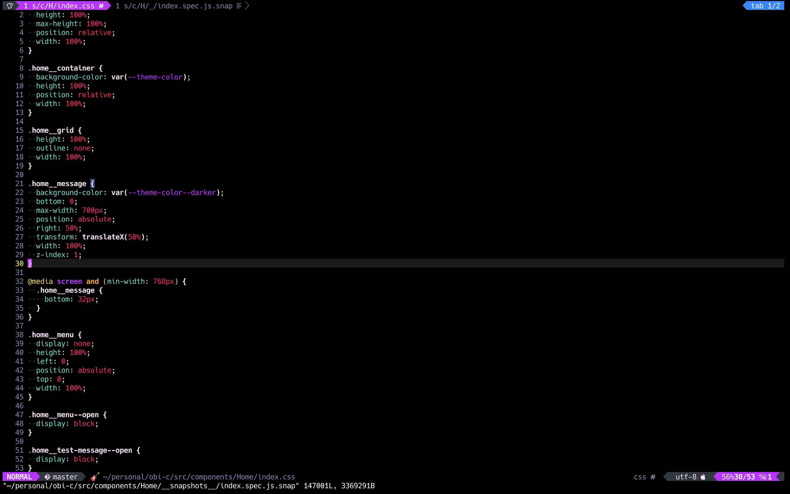
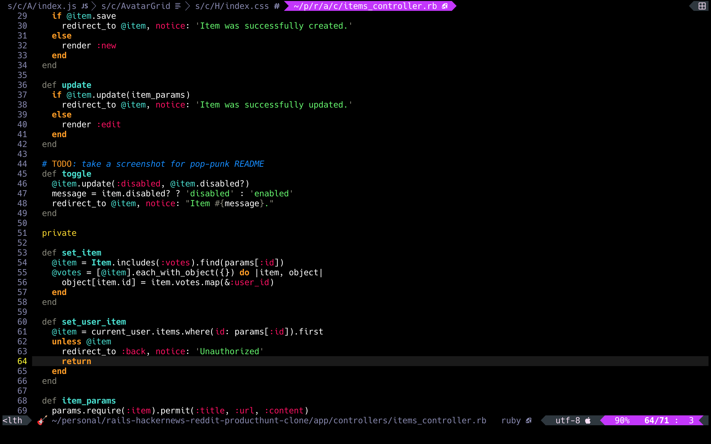

# 🎸 Pop-Punk

## Installation

Just like any other vim theme.  Use your plugin manager of choice, or
just copy `colors/pop-punk.vim` to your local `.vim/colors/` directory.

```vim
" .vimrc
colorscheme pop-punk
```

## Notes

Screenshots were taken with the following settings:

* Hack font (Nerd Font patched version) with vim-devicons
* Airline status/tab bars
* iTerm2 v3.3 (24-bit color)

## Screenshots






## To do

* Slightly more robust documentation
* Airline theme
